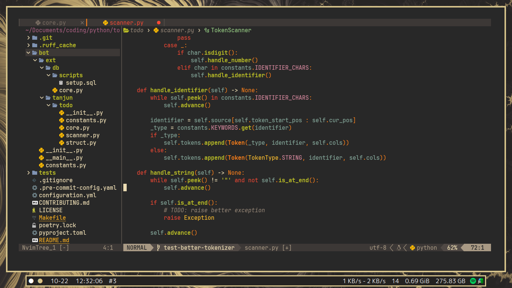
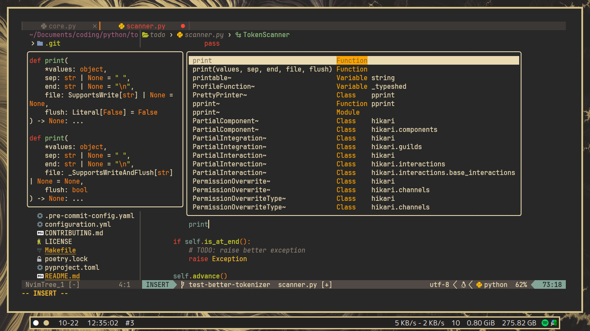
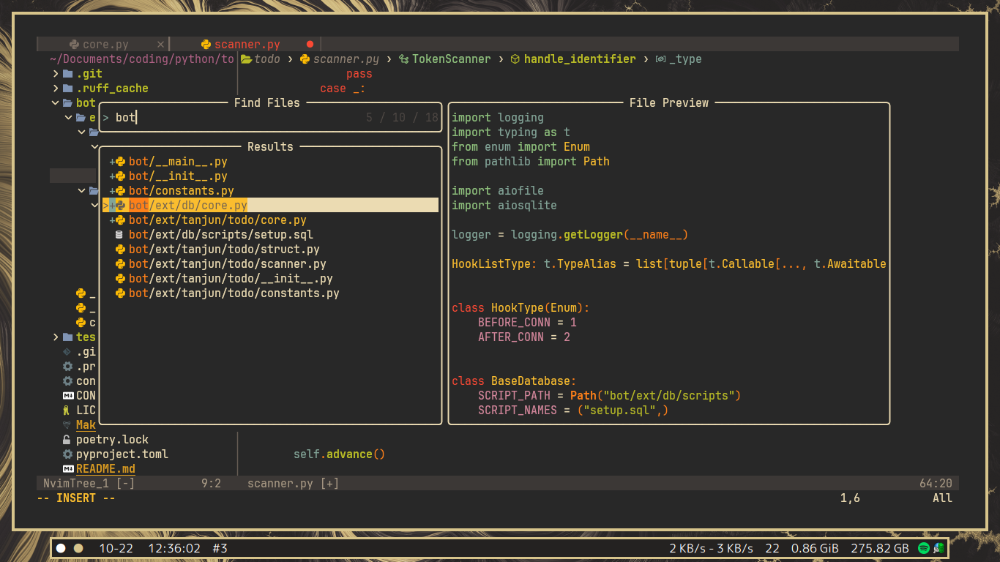
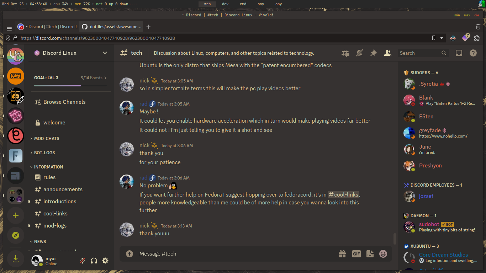

My personal dotfiles.

# Notes
* I use Colemak layout, so all the keymapping is based on Colemak.
* My mission is to make things efficient, not very pretty.

# Screenshots
Screenshots can be old.

### Neovim

### Awesome (WM)

